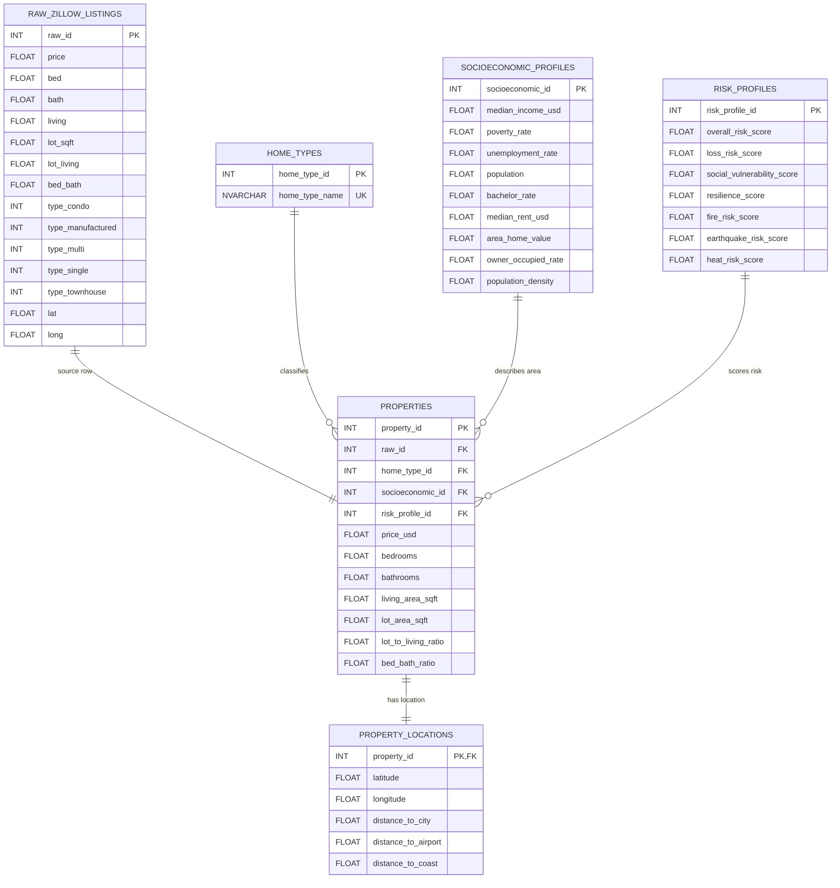

# Zillow Real Estate Price Analysis Database

Tài liệu này mô tả thiết kế cơ sở dữ liệu cho dự án **Zillow Real Estate Price Analysis**.  
Database được thiết kế trên **SQL Server** để lưu trữ và phân tích dữ liệu bất động sản từ file `zillow_final(4).csv`.

Dữ liệu ban đầu là một bảng phẳng dùng cho Machine Learning. Vì vậy, nhóm đã thiết kế lại thành cơ sở dữ liệu quan hệ để dữ liệu rõ ràng hơn, giảm trùng lặp và dễ truy vấn phân tích.

---

## 1. Cấu trúc file trong project

```text
zillow_project/
│
├── 00_create_database.sql
├── 01_zillow_schema.sql
├── 02_zillow_seed_data.sql
├── 03_zillow_queries.sql
└── README.md
```

Ý nghĩa từng file:

| File | Chức năng |
|---|---|
| `00_create_database.sql` | Tạo database `ZillowRealEstateDB` |
| `01_zillow_schema.sql` | Tạo bảng, khóa chính, khóa ngoại và index |
| `02_zillow_seed_data.sql` | Insert dữ liệu vào database |
| `03_zillow_queries.sql` | Tạo view và thực hiện các query phân tích |
| `README.md` | Giải thích thiết kế database |

---

## 2. Mục tiêu thiết kế database

Dataset ban đầu chứa nhiều nhóm dữ liệu khác nhau trong cùng một bảng, ví dụ:

- Giá nhà
- Số phòng ngủ, phòng tắm
- Diện tích nhà, diện tích đất
- Loại nhà
- Vị trí địa lý
- Thông tin kinh tế - xã hội
- Chỉ số rủi ro khu vực

Nếu để tất cả dữ liệu trong một bảng thì dễ bị rối và khó quản lý. Vì vậy, database được tách thành nhiều bảng theo từng nhóm ý nghĩa.

---

## 3. Sơ đồ ERD



---

## 4. Mô tả các bảng

### 4.1. Bảng `raw_zillow_listings`

Bảng này lưu dữ liệu thô ban đầu từ file CSV.

| Column | Type | Key | Description |
|---|---|---|---|
| `raw_id` | INT | PK | ID dòng dữ liệu gốc |
| `price` | FLOAT | | Giá nhà ban đầu |
| `bed` | FLOAT | | Số phòng ngủ |
| `bath` | FLOAT | | Số phòng tắm |
| `living` | FLOAT | | Diện tích sinh hoạt |
| `lot_sqft` | FLOAT | | Diện tích đất |
| `lot_living` | FLOAT | | Tỷ lệ diện tích đất / diện tích nhà |
| `bed_bath` | FLOAT | | Tỷ lệ phòng ngủ / phòng tắm |
| `type_condo` | INT | | One-hot loại nhà condo |
| `type_manufactured` | INT | | One-hot loại nhà manufactured |
| `type_multi` | INT | | One-hot loại nhà multi-family |
| `type_single` | INT | | One-hot loại nhà single-family |
| `type_townhouse` | INT | | One-hot loại nhà townhouse |
| `lat` | FLOAT | | Vĩ độ |
| `long` | FLOAT | | Kinh độ |

Bảng này giúp giữ lại dữ liệu gốc để đối chiếu khi cần.

---

### 4.2. Bảng `home_types`

Bảng này lưu danh mục loại nhà.

| Column | Type | Key | Description |
|---|---|---|---|
| `home_type_id` | INT | PK | ID loại nhà |
| `home_type_name` | NVARCHAR(100) | UK | Tên loại nhà |

Các loại nhà gồm:

```text
condo
manufactured
multi_family
single_family
townhouse
unknown
```

Các cột one-hot trong CSV như `type_condo`, `type_single`, `type_townhouse` được chuẩn hóa thành bảng `home_types`.

---

### 4.3. Bảng `socioeconomic_profiles`

Bảng này lưu thông tin kinh tế - xã hội của khu vực.

| Column | Type | Key | Description |
|---|---|---|---|
| `socioeconomic_id` | INT | PK | ID hồ sơ kinh tế - xã hội |
| `median_income_usd` | FLOAT | | Thu nhập trung vị |
| `poverty_rate` | FLOAT | | Tỷ lệ nghèo |
| `unemployment_rate` | FLOAT | | Tỷ lệ thất nghiệp |
| `population` | FLOAT | | Dân số |
| `bachelor_rate` | FLOAT | | Tỷ lệ có bằng cử nhân |
| `median_rent_usd` | FLOAT | | Giá thuê trung vị |
| `area_home_value` | FLOAT | | Giá trị nhà khu vực |
| `owner_occupied_rate` | FLOAT | | Tỷ lệ nhà có chủ sở hữu đang ở |
| `population_density` | FLOAT | | Mật độ dân số |

Nhóm biến này được tách riêng vì chúng mô tả khu vực, không phải đặc điểm riêng của từng căn nhà.

---

### 4.4. Bảng `risk_profiles`

Bảng này lưu các chỉ số rủi ro khu vực.

| Column | Type | Key | Description |
|---|---|---|---|
| `risk_profile_id` | INT | PK | ID hồ sơ rủi ro |
| `overall_risk_score` | FLOAT | | Rủi ro tổng thể |
| `loss_risk_score` | FLOAT | | Rủi ro thiệt hại |
| `social_vulnerability_score` | FLOAT | | Mức dễ tổn thương xã hội |
| `resilience_score` | FLOAT | | Khả năng phục hồi |
| `fire_risk_score` | FLOAT | | Rủi ro cháy |
| `earthquake_risk_score` | FLOAT | | Rủi ro động đất |
| `heat_risk_score` | FLOAT | | Rủi ro nắng nóng |

Nhóm biến rủi ro được tách riêng để dễ phân tích ảnh hưởng của rủi ro tới giá nhà.

---

### 4.5. Bảng `properties`

Bảng này là bảng trung tâm, lưu thông tin chính của từng căn nhà.

| Column | Type | Key | Description |
|---|---|---|---|
| `property_id` | INT | PK | ID căn nhà |
| `raw_id` | INT | FK | Liên kết tới dữ liệu gốc |
| `home_type_id` | INT | FK | Liên kết tới loại nhà |
| `socioeconomic_id` | INT | FK | Liên kết tới hồ sơ kinh tế - xã hội |
| `risk_profile_id` | INT | FK | Liên kết tới hồ sơ rủi ro |
| `price_usd` | FLOAT | | Giá nhà |
| `bedrooms` | FLOAT | | Số phòng ngủ |
| `bathrooms` | FLOAT | | Số phòng tắm |
| `living_area_sqft` | FLOAT | | Diện tích sinh hoạt |
| `lot_area_sqft` | FLOAT | | Diện tích đất |
| `lot_to_living_ratio` | FLOAT | | Tỷ lệ đất / diện tích nhà |
| `bed_bath_ratio` | FLOAT | | Tỷ lệ phòng ngủ / phòng tắm |

Bảng `properties` liên kết với các bảng khác bằng khóa ngoại.

---

### 4.6. Bảng `property_locations`

Bảng này lưu thông tin vị trí của từng căn nhà.

| Column | Type | Key | Description |
|---|---|---|---|
| `property_id` | INT | PK, FK | ID căn nhà |
| `latitude` | FLOAT | | Vĩ độ |
| `longitude` | FLOAT | | Kinh độ |
| `distance_to_city` | FLOAT | | Khoảng cách tới thành phố lớn gần nhất |
| `distance_to_airport` | FLOAT | | Khoảng cách tới sân bay gần nhất |
| `distance_to_coast` | FLOAT | | Khoảng cách tới bờ biển |

Quan hệ giữa `properties` và `property_locations` là 1-1.

---

## 5. Mối quan hệ giữa các bảng

```text
home_types 1 ---- n properties

socioeconomic_profiles 1 ---- n properties

risk_profiles 1 ---- n properties

raw_zillow_listings 1 ---- 1 properties

properties 1 ---- 1 property_locations
```

Giải thích:

- Một loại nhà có thể có nhiều căn nhà.
- Một hồ sơ kinh tế - xã hội có thể được nhiều căn nhà dùng chung.
- Một hồ sơ rủi ro có thể được nhiều căn nhà dùng chung.
- Một dòng dữ liệu gốc tạo ra một căn nhà trong bảng `properties`.
- Một căn nhà có đúng một bộ thông tin vị trí.

---

## 6. View dữ liệu sạch

File `03_zillow_queries.sql` tạo view:

```sql
CREATE VIEW dbo.view_property_clean AS ...
```

View này join các bảng:

```text
properties
home_types
property_locations
socioeconomic_profiles
risk_profiles
```

Mục đích của view:

- Gom dữ liệu đã chuẩn hóa lại thành một bảng ảo.
- Giúp phân tích dễ hơn.
- Không cần viết JOIN nhiều lần.

---

## 7. Thứ tự chạy file SQL

Chạy theo đúng thứ tự sau trong SQL Server Management Studio:

### Bước 1: Tạo database

```sql
00_create_database.sql
```

File này tạo database:

```text
ZillowRealEstateDB
```

### Bước 2: Tạo schema

```sql
01_zillow_schema.sql
```

File này tạo các bảng, khóa chính, khóa ngoại và index.

### Bước 3: Insert dữ liệu

```sql
02_zillow_seed_data.sql
```

File này insert dữ liệu vào các bảng.

### Bước 4: Tạo view và chạy query

```sql
03_zillow_queries.sql
```

File này tạo `view_property_clean` và thực hiện các query phân tích.

---

## 8. Kiểm tra số dòng sau khi insert

Sau khi chạy xong, có thể kiểm tra bằng query:

```sql
SELECT 'raw_zillow_listings' AS table_name, COUNT(*) AS total_rows FROM dbo.raw_zillow_listings
UNION ALL
SELECT 'home_types' AS table_name, COUNT(*) AS total_rows FROM dbo.home_types
UNION ALL
SELECT 'socioeconomic_profiles' AS table_name, COUNT(*) AS total_rows FROM dbo.socioeconomic_profiles
UNION ALL
SELECT 'risk_profiles' AS table_name, COUNT(*) AS total_rows FROM dbo.risk_profiles
UNION ALL
SELECT 'properties' AS table_name, COUNT(*) AS total_rows FROM dbo.properties
UNION ALL
SELECT 'property_locations' AS table_name, COUNT(*) AS total_rows FROM dbo.property_locations;
```

Kết quả mong đợi:

```text
raw_zillow_listings        4468 rows
home_types                 6 rows
socioeconomic_profiles     714 rows
risk_profiles              1007 rows
properties                 4468 rows
property_locations         4468 rows
```

---

## 9. 5 câu hỏi phân tích chính

File `03_zillow_queries.sql` giải quyết 5 câu hỏi:

### Câu hỏi 1: Loại nhà nào có giá trung bình cao nhất?

Phân tích giá nhà trung bình theo từng loại nhà như condo, townhouse, single-family.

### Câu hỏi 2: Dataset có nhiều nhà thuộc phân khúc giá nào?

Chia giá nhà thành các nhóm:

```text
Low price
Medium price
High price
Luxury price
```

### Câu hỏi 3: Khu vực thu nhập cao có giá nhà cao hơn không?

So sánh giá nhà trung bình giữa các nhóm khu vực thu nhập thấp, trung bình và cao.

### Câu hỏi 4: Rủi ro khu vực ảnh hưởng thế nào đến giá nhà?

Phân tích giá nhà theo nhóm rủi ro tổng thể và các chỉ số cháy, động đất, nắng nóng.

### Câu hỏi 5: Nhà gần thành phố có giá cao hơn không?

Phân tích ảnh hưởng của khoảng cách tới thành phố lớn tới giá nhà.

---

## 10. Câu giải thích ngắn khi thuyết trình

Database được thiết kế bằng cách tách dữ liệu Zillow ban đầu thành nhiều bảng theo từng nhóm ý nghĩa.  
Bảng `properties` là bảng trung tâm, liên kết với `home_types`, `socioeconomic_profiles`, `risk_profiles` và `property_locations` thông qua khóa ngoại.  
Cách thiết kế này giúp giảm trùng lặp dữ liệu, quản lý quan hệ rõ ràng và dễ thực hiện các truy vấn phân tích giá nhà.
