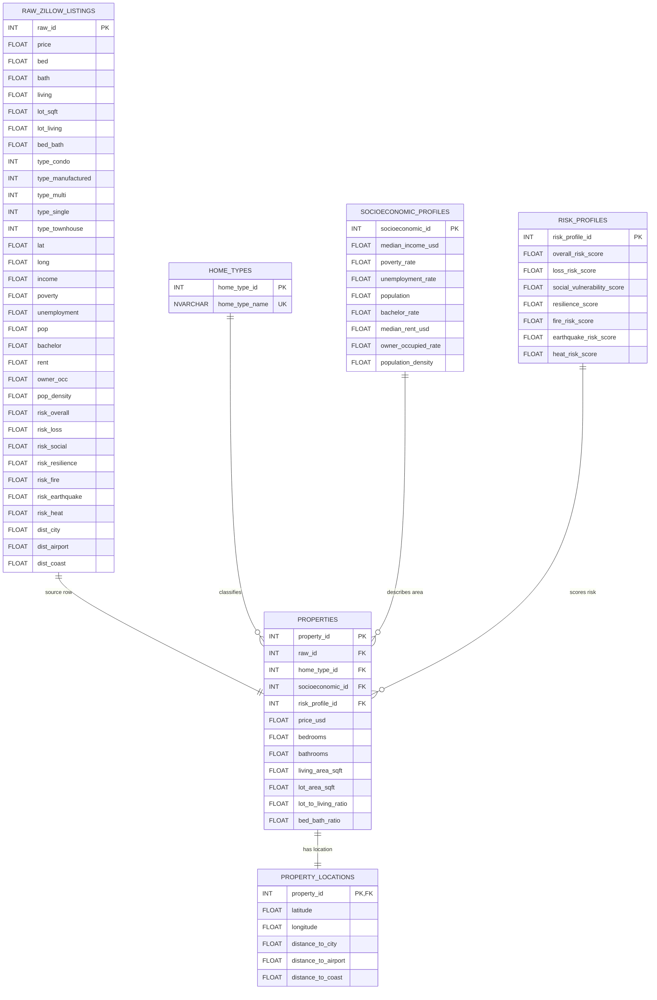

# Zillow Real Estate Database

Thư mục này chứa các script SQL Server để thiết kế database quan hệ từ dataset cuối cùng `data_csv/zillow_final.csv`.

## Cấu Trúc File

```text
database/
├── create_database.sql
├── schema.sql
├── insert_data.sql
├── query_data.sql
└── README.md
```

| File | Chức năng |
|---|---|
| `create_database.sql` | Tạo database `ZillowRealEstateDB` nếu chưa tồn tại |
| `schema.sql` | Tạo bảng, khóa chính, khóa ngoại và index |
| `insert_data.sql` | Insert dữ liệu từ `zillow_final.csv` đã làm sạch |
| `query_data.sql` | Tạo view sạch và chạy các truy vấn phân tích |

## Dataset Được Insert

`insert_data.sql` được regenerate từ `data_csv/zillow_final.csv` và khớp với 32 cột của dataset cuối cùng.

| Bảng | Số dòng |
|---|---:|
| `raw_zillow_listings` | 4,251 |
| `properties` | 4,251 |
| `property_locations` | 4,251 |
| `home_types` | 6 |
| `socioeconomic_profiles` | 713 |
| `risk_profiles` | 1,002 |

## Thiết Kế Database

Database được tách từ một bảng phẳng thành các nhóm bảng theo ý nghĩa dữ liệu:

- `raw_zillow_listings`: lưu dataset cuối cùng ở dạng staging để đối chiếu.
- `home_types`: danh mục loại nhà từ các biến one-hot.
- `socioeconomic_profiles`: thông tin kinh tế - xã hội của khu vực.
- `risk_profiles`: các chỉ số rủi ro tự nhiên/khu vực.
- `properties`: bảng trung tâm chứa thông tin từng căn nhà và khóa ngoại đến các bảng dimension.
- `property_locations`: thông tin tọa độ và khoảng cách địa lý của từng căn nhà.

## ERD



## Cách Chạy

Chạy các script theo thứ tự trong SQL Server:

```text
create_database.sql
schema.sql
insert_data.sql
query_data.sql
```

`query_data.sql` tạo `dbo.view_property_clean`, sau đó trả lời các câu hỏi phân tích như loại nhà có giá cao nhất, phân khúc giá phổ biến, ảnh hưởng của thu nhập/rủi ro/khoảng cách đến giá nhà và giá trên mỗi sqft.
